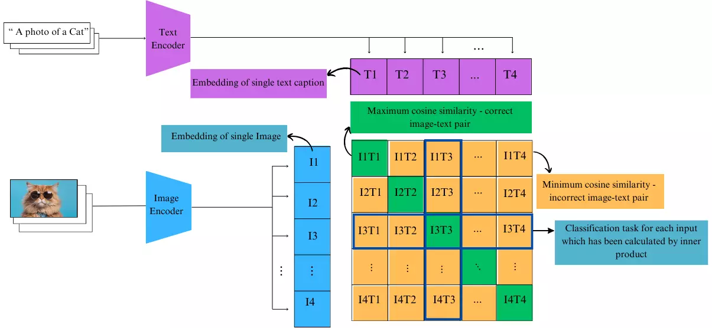

# CLIP

This directory contains notebooks and resources related to the CLIP project for the Silicon Community. The primary notebook in this directory is:

- **CLIP_Silicon_Community.ipynb**: This notebook contains an example on how to use the CLIP model for various tasks related to image and text embeddings. It includes examples of how to load the model, preprocess data, and perform inference.

CLIP is an Constrative Language-Imaege Pre-training, this means that image and text are having the very simialr embeddings in latent space. For more information you can also visit the OpenAI [github page](https://github.com/openai/CLIP) and you can read the paper in [CLIP paper](https://arxiv.org/abs/2103.00020). The below image is representing the overall architecture of the model.

## CLIP Resources
- [Colab](https://colab.research.google.com/drive/1KvmR5oIGrzatp5vCy60JWO9tSGngyQTv?usp=sharing)
- [CLIP-model-explained (farsi)](https://virgool.io/silicon-brain/%D9%85%D8%AF%D9%84-clip-%D8%A7%D8%B2-%D8%B5%D9%81%D8%B1-%D8%AA%D8%A7-%D8%B5%D8%AF-kj26olguul45)

## contributor
- [Zahra Alizadeh](https://github.com/zahra-alizadeh)
- [Roksana Mirzaei](https://github.com/roksana-mirzaei)

